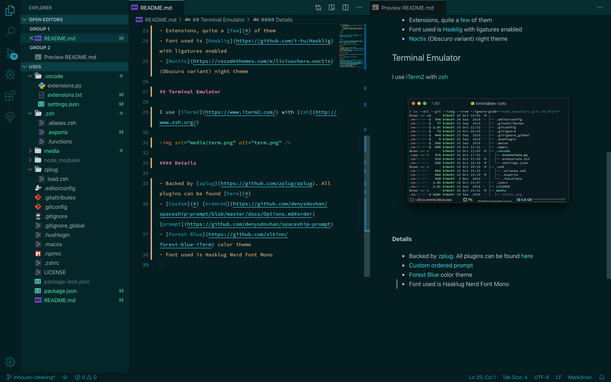

> Some of my defaults for development on a Windows machine &mdash; okay, maybe more than _just_ dotfiles

## Editor

I recently made the switch from Atom to [Visual Studio Code](https://code.visualstudio.com/) because of one **huge** reason: [Atom](https://atom.io/) gets _ridiculously_ slow when trying to load large projects.

I use the Material Theme (Palenight). My editor settings can be found [here](https://github.com/yeskunall/dotfiles/blob/master/.vscode.settings/settings.json).

If you're curious, the font I use is [Fira Code](https://github.com/tonsky/FiraCode) since VSCode has support for ligatures.

_... More coming soon!_