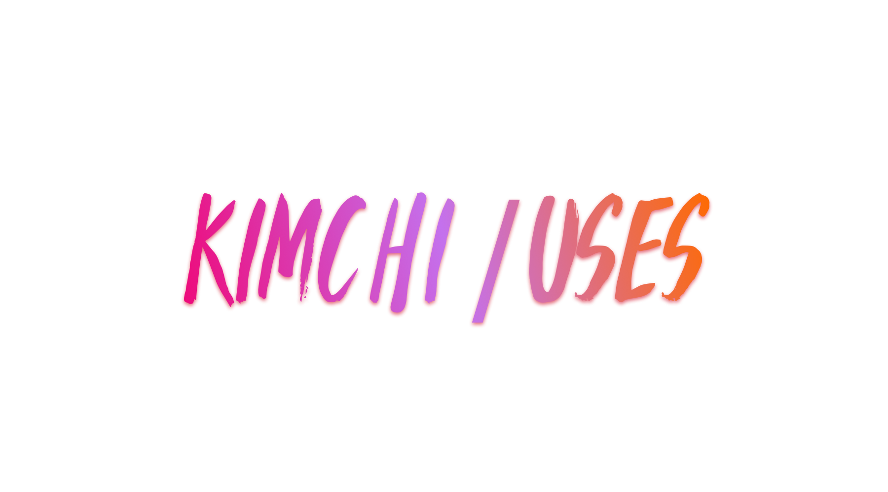

> _[Kimchi uses](https://kimchi.now.sh/uses)_

## Editor

I'm currently using [VS Code](https://code.visualstudio.com/). I use the Material Theme, Palenight color variant. My other editor settings can be found [here](https://github.com/yeskunall/uses/blob/master/.vscode.settings/settings.json). If you're curious, the font I use is [Fira Code](https://github.com/tonsky/FiraCode) since VSCode has support for ligatures.

> _If you're curious, I sometimes write about my musings at_ [kimchi.now.sh/musings](https://kimchi.now.sh/musings).

### VS Code Extensions

Extensions I use regularly. These are updated frequently.

- [Babel JavaScript](https://marketplace.visualstudio.com/items?itemName=mgmcdermott.vscode-language-babel) (_mgmcdermott.vscode-language-babel-0.0.20_)
- [ESLint](https://marketplace.visualstudio.com/items?itemName=dbaeumer.vscode-eslint) (_dbaeumer.vscode-eslint-1.6.0_)
- [EditorConfig for VS Code](https://marketplace.visualstudio.com/items?itemName=EditorConfig.EditorConfig) (_EditorConfig.editorconfig-0.12.4_)
- [Flow Language Support](https://marketplace.visualstudio.com/items?itemName=flowtype.flow-for-vscode) (_flowtype.flow-for-vscode-0.8.4_)
- [Go](https://marketplace.visualstudio.com/items?itemName=ms-vscode.Go) (_ms-vscode.go-0.6.89_)
- [Import Cost](https://marketplace.visualstudio.com/items?itemName=wix.vscode-import-cost) (_wix.vscode-import-cost-2.9.0_)
- [Material Icon Theme](https://marketplace.visualstudio.com/items?itemName=PKief.material-icon-theme) (_pkief.material-icon-theme-3.6.0_)
- [Material Theme](https://marketplace.visualstudio.com/items?itemName=Equinusocio.vsc-material-theme) (_equinusocio.vsc-material-theme-2.4.2_)
- [Python](https://marketplace.visualstudio.com/items?itemName=ms-python.python) (_ms-python.python-2018.8.0_)
- [TODO Hightlight](https://marketplace.visualstudio.com/items?itemName=wayou.vscode-todo-highlight) (_wayou.vscode-todo-highlight-1.0.4_)
- [Version Lens](https://marketplace.visualstudio.com/items?itemName=pflannery.vscode-versionlens) (_pflannery.vscode-versionlens-0.21.1_)

## Terminal

[iTerm2](https://www.iterm2.com/) is my preferred terminal. I use [zsh](http://www.zsh.org/) backed by [Oh My Zsh](http://ohmyz.sh/). I'm using the [spaceship-prompt](https://github.com/denysdovhan/spaceship-prompt).

The font I use is [Meslo LG L DZ Regular for Powerline (11 pt)](https://github.com/powerline/fonts/blob/master/Meslo%20Dotted/Meslo%20LG%20L%20DZ%20Regular%20for%20Powerline.ttf), although I wish to switch to a font that supports ligatures.

## Tools

- [Bear](https://bear.app/) for notes
- [To-do by Microsoft](https://to-do.microsoft.com) for task management. I used [Wunderlist](https://www.wunderlist.com/) before it was shut down
- [Sketch](https://www.sketchapp.com/) for rapid prototyping and design
