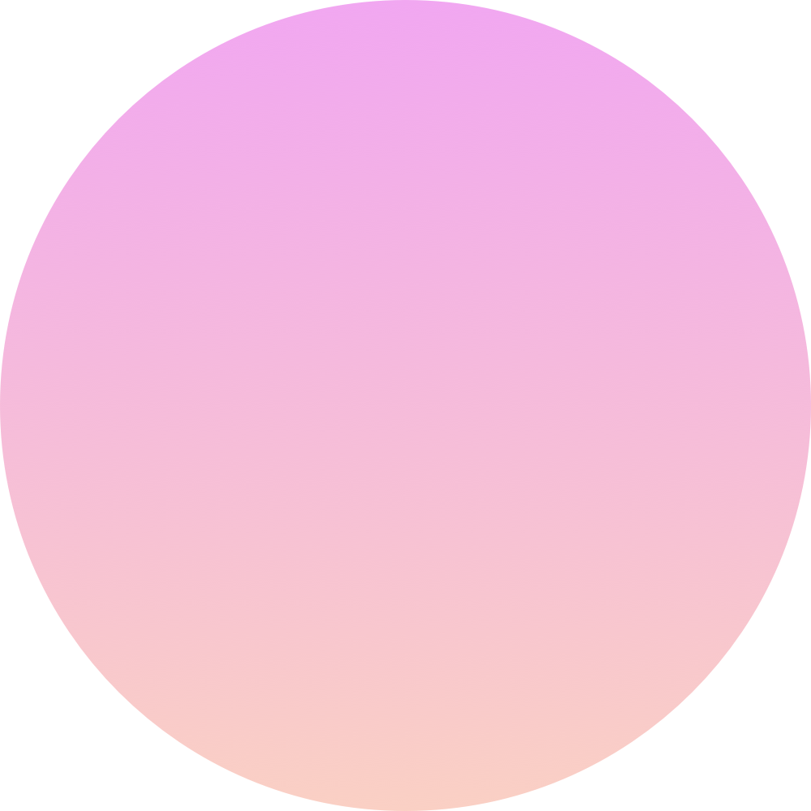
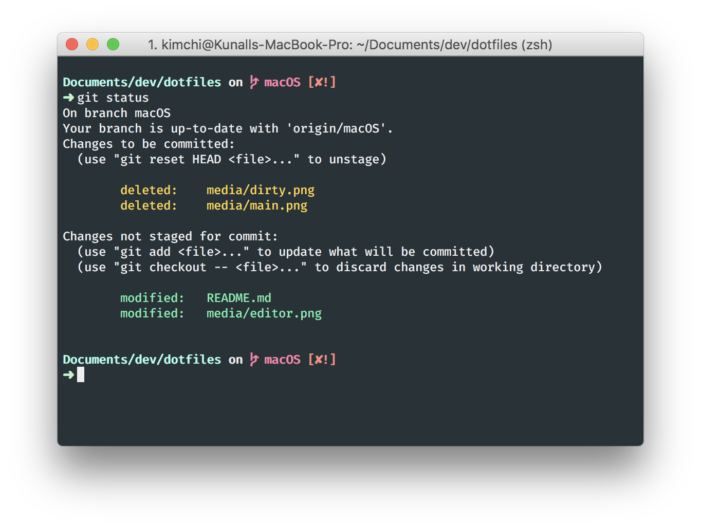

    
    <h1>kimchi/uses</h1>
    

        <b>
            🌺&nbsp;What makes my macOS setup even more amazing than it already is&nbsp;&nbsp;🌺&nbsp;
        </b>
    

     

## Editor

I use [VS Code](https://code.visualstudio.com/) with these [settings](https://github.com/yeskunall/uses/blob/master/.vscode.settings/settings.json)

#### Details

- Extensions, quite a [few](#) of them
- Font used is [Hasklig](https://github.com/i-tu/Hasklig) with ligatures enabled
- [Noctis](https://vscodethemes.com/e/liviuschera.noctis) (Obscuro variant) night theme

## Terminal Emulator

I use [iTerm2](https://www.iterm2.com/) with [zsh](http://www.zsh.org/)

#### Details

- Backed by [zplug](https://github.com/zplug/zplug). All plugins can be found [here](#)
- [Custom](#) [ordered](https://github.com/denysdovhan/spaceship-prompt/blob/master/docs/Options.md#order) [prompt](https://github.com/denysdovhan/spaceship-prompt)
- [Forest Blue](https://github.com/olkinn/forest-blue-iTerm) color theme
- Font used is Hasklug Nerd Font Mono
