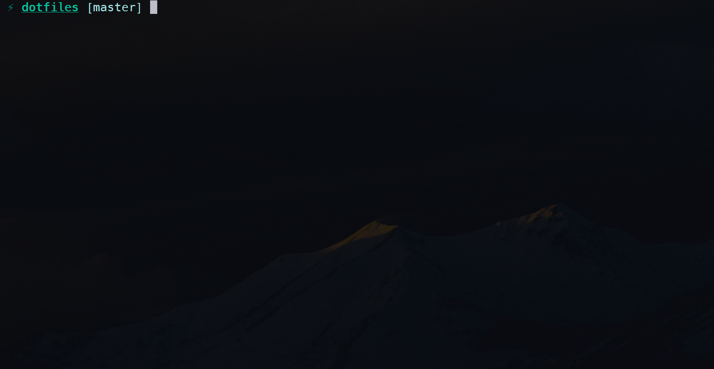
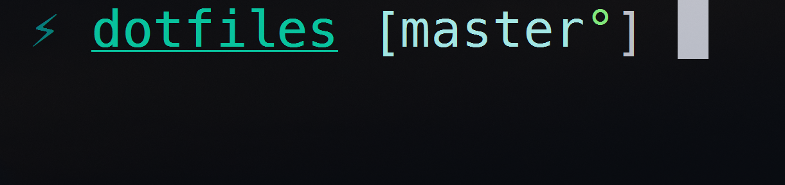

# Kimchi's dotfiles :sushi: :curry:

This repo holds all my configs. My settings and preferences change quite often, which is why I decided to put these files under version control.

My terminal theme was inspired by the [DuoTone Dark Sea Syntax](https://github.com/simurai/duotone-dark-sea-syntax). In fact, I use the same theme in Atom. Shows the current branch, provided the CWD is a `git` repository.

If there are unstaged changes, the prompt adds a simple, unobtrusive symbol, indicating that the working branch is [dirty](https://www.kernel.org/pub/software/scm/git/docs/gitglossary.html#def_dirty).

