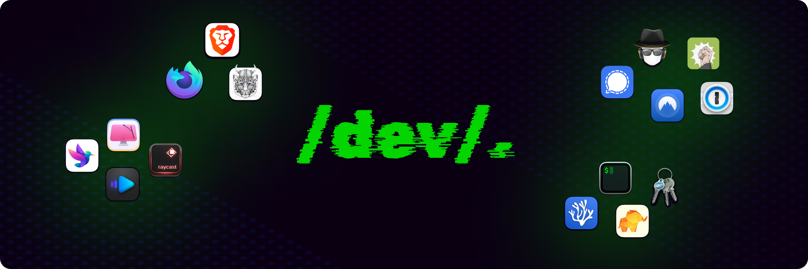

<a href="https://github.com/yeskunall/dotfiles">
<picture>
  
</picture>
</a>

## What is this?

This is my minimal config (setup), tailored to work with multiple operating systems with as little as possible, while providing the best possible DX, and performance possible.

- **Minimal.** A setup that is close to metal. Try to work with OS built-ins, and rely on very few [applications & binaries](./brew/Brewfile)
- **Performance is paramount.** No matter the operating system, prioritize startup and run-time performance. Try not to _automatically_ install dependencies. Lazy-load them wherever possible to make everything feel snappier
- **Replicable, and recognizable.** Every environment should feel [familiar](#system), or as close to `$HOME` as possible

## 🛠 Developer Tools

- [Browsers](#browsers)
  - [Brave](https://brave.com/)
  - [Firefox Nightly](https://wiki.mozilla.org/Nightly)
- [Editor](#editor)
  - [VSCodium](https://vscodium.com/) in [portable mode](https://code.visualstudio.com/docs/editor/portable)
- [Terminal Emulator](#terminal-emulator)
  - iTerm2

## License

This repository and its contents are under the [MIT license](license.md)

