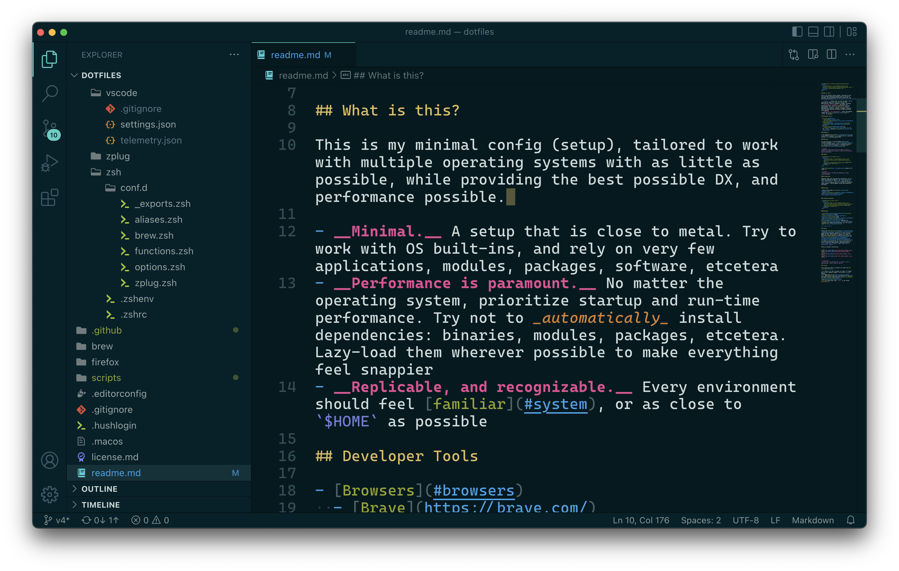
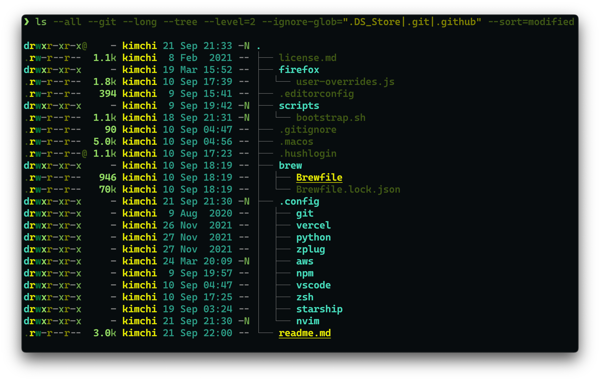

<a href="https://github.com/yeskunall/dotfiles">
<picture>
  
</picture>
</a>

## What is this?

This is my minimal config (setup), tailored to work with multiple operating systems with as little as possible, while providing the best possible DX, and performance possible.

- __Minimal.__ A setup that is close to metal. Try to work with OS built-ins, and rely on very few applications, modules, packages, software, etcetera
- __Performance is paramount.__ No matter the operating system, prioritize startup and run-time performance. Try not to _automatically_ install dependencies: binaries, modules, packages, etcetera. Lazy-load them wherever possible to make everything feel snappier
- __Replicable, and recognizable.__ Every environment should feel [familiar](#system), or as close to `$HOME` as possible

## Developer Tools

- [Browsers](#browsers)
  - [Brave](https://brave.com/)
  - [Firefox Nightly](https://wiki.mozilla.org/Nightly)
- [Editor](#editor)
  - [VSCodium](https://vscodium.com/) in [portable mode](https://code.visualstudio.com/docs/editor/portable)
- [Terminal Emulator](#terminal-emulator)
  - iTerm2

### Browsers

I use Sindre’s [Velja](https://sindresorhus.com/velja) as my default browser.[^1] to open links in a specific browser, or a matching application.

#### Details

For the most part, I use FF Nightly with a very slightly extended [`user.js`](./firefox/user-overrides.js). In instances where a site is completely broken, or refuses to work in Nightly, I use Brave with [Shields](https://brave.com/shields/) up.

> **Note**
> However, some sites will just refuse to work no matter what should you choose to have strict privacy/security defaults

### Editor

<a href="https://vscodium.com/">
  <picture>
    
  </picture>
</a>

I use [VSCodium](https://vscodium.com/) instead of VS Code[^2].

> **Note**
> Moving forward, VS Code and VSCodium are used interchangeably

#### Extensions

VSCodium comes with some built-in extensions, all of which are enabled by default. Hit <kbd>ctrl/⌘</kbd> + <kbd>⇧ Shift</kbd> + <kbd>x</kbd>, then search for `@builtin` to bring up the list. Instead of disabling these though, I would suggest installing extensions sparingly.


#### Details

- Editor-wide global [settings](.config/vscode/settings.json)
- Font is [Caskaydia Cove](https://github.com/Homebrew/homebrew-cask-fonts/blob/master/Casks/font-caskaydia-cove-nerd-font.rb)


### Terminal Emulator

<a href="https://iterm2.com/">
  <picture>
    
  </picture>
</a>

I use [iTerm2](https://www.iterm2.com/) with `zsh` as the `$SHELL`, backed by [zplug](https://github.com/zplug/zplug). Startup time is very paramount here, so I am constantly working on my shell config to make it feel more snappy. Here’s a handy [script](.config/zsh/conf.d/functions.zsh#L66) to measure your shell startup times. It is fairly accurate, but for more realistic benchmarks, use [`zsh-bench`](https://github.com/romkatv/zsh-bench).


#### Details

- [Custom](.config/starship/config.toml) [starship](https://starship.rs) prompt
- [Forest Blue](https://github.com/olkinn/forest-blue-iTerm) color theme
- Font is [Caskaydia Cove](https://github.com/Homebrew/homebrew-cask-fonts/blob/master/Casks/font-caskaydia-cove-nerd-font.rb) (patched via [NerdFonts](https://www.nerdfonts.com/font-downloads))
- [Plugins](.config/zplug/load.zsh) are loaded asynchronously

## System

Follow the [XDG Base Directory](https://specifications.freedesktop.org/basedir-spec/basedir-spec-latest.html) specification wherever possible.[^3] That includes macOS as well. While macOS is based on a flavor of BSD-Linux, Apple chooses to organize directories and files [very differently](https://developer.apple.com/library/archive/documentation/FileManagement/Conceptual/FileSystemProgrammingGuide/Introduction/Introduction.html#//apple_ref/doc/uid/TP40010672).[^4] If you’re using macOS like me, then you’re going to have to deal with applications taking up space in `/Library/Application\ Support` and `$HOME/Library/Application\ Support/`.

Here’s my default directories:

```sh
export XDG_CACHE_HOME=${XDG_CACHE_HOME:-$HOME/.cache};
export XDG_CONFIG_HOME=${XDG_CONFIG_HOME:-$HOME/.config};
export XDG_DATA_HOME=${XDG_DATA_HOME:-$HOME/.local/share};
export XDG_STATE_HOME=${XDG_STATE_HOME:-$HOME/.local/state};
```

> **Warning**
> Do not set `XDG_RUNTIME_DIR` on macOS. A lot of applications _could_ break if you do.

## License

This repository and its contents are under the [MIT license](license.md)

[^1]: While it is not a browser in itself, it allows you to set a default browser. In my case, it is FF Nightly
[^2]: Read why [here](https://vscodium.com/#why)
[^3]: Edwin Kofler goes over the benefits of using the XDG Base Directory specification in [Use the XDG Base Directory specification!](https://xdgbasedirectoryspecification.com/)
[^4]: Not surprising. They __love__ to do things _‘differently’_
